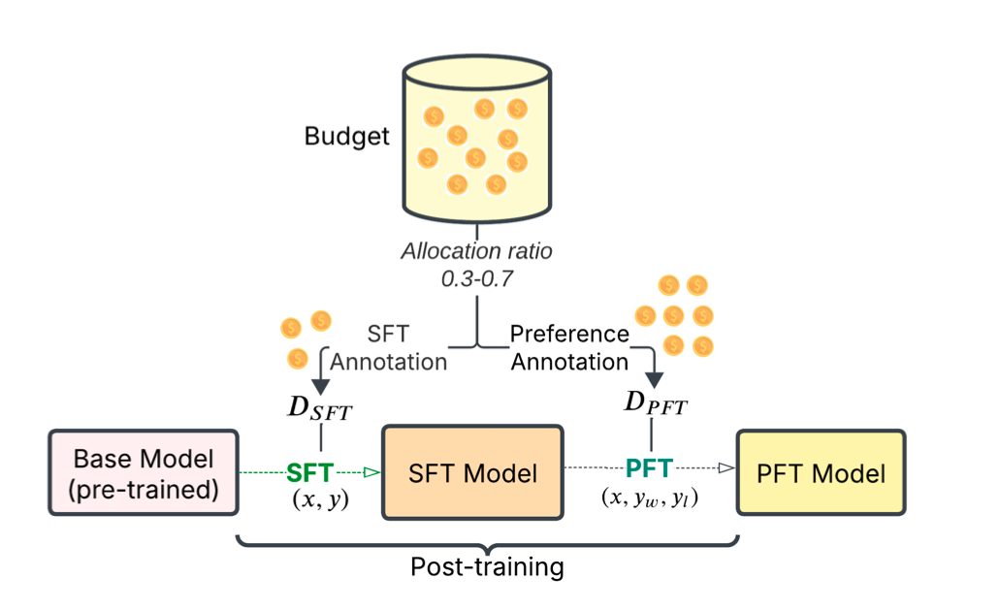

# Balancing the Budget

Code for the paper Balancing the Budget: Understanding Trade-offs Between Supervised and
Preference-Based Finetuning



Link - [https://arxiv.org/pdf/2502.11284](https://arxiv.org/pdf/2502.11284)

### Install

```bash
conda create --name <env> --file requirements.txt
```

Also add the IFEval [repository](https://github.com/google-research/google-research/tree/master/instruction_following_eval) in the root folder.

### Data

Process all the datasets 

```bash
bash tuning/data_processing.sh
```

### Run

1. Edit the ```train_sizes``` list in ```tuning/run.sh``` to add different #train examples to train the models.
2. Run ```bash tuning/run.sh``` and select the task, sft-pft ratio and base model.


## Reference

If you find our work or code useful, please cite the paper:

```
@misc{raghavendra2025balancingbudgetunderstandingtradeoffs,
      title={Balancing the Budget: Understanding Trade-offs Between Supervised and Preference-Based Finetuning}, 
      author={Mohit Raghavendra and Junmo Kang and Alan Ritter},
      year={2025},
      eprint={2502.11284},
      archivePrefix={arXiv},
      primaryClass={cs.LG},
      url={https://arxiv.org/abs/2502.11284}, 
}
```

